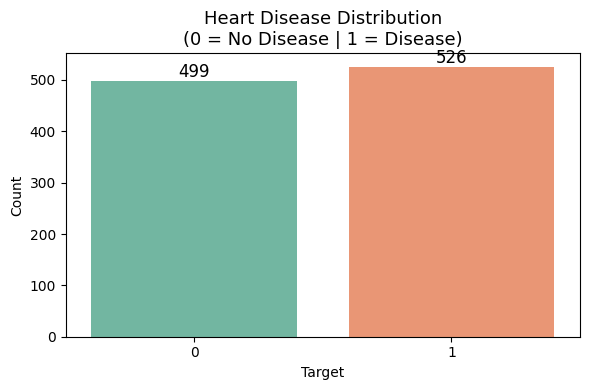
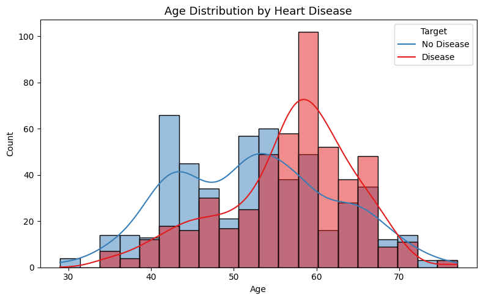
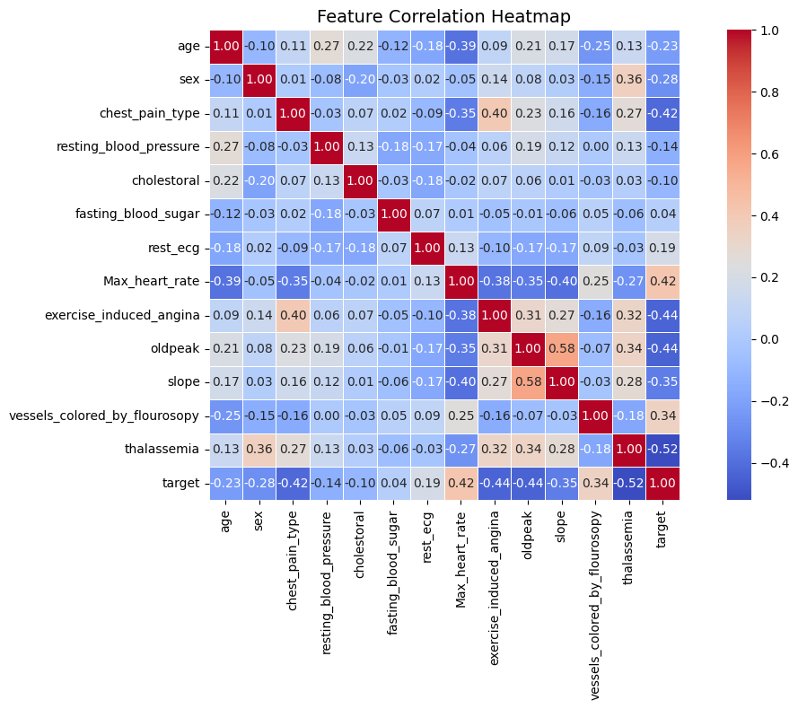
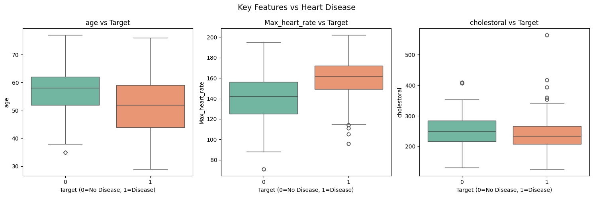
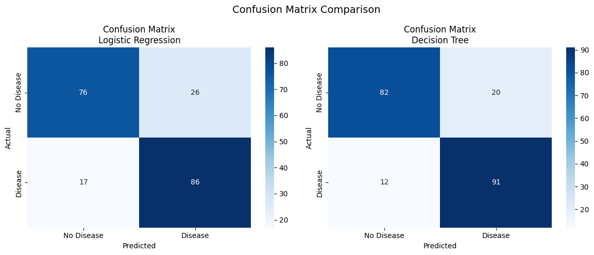
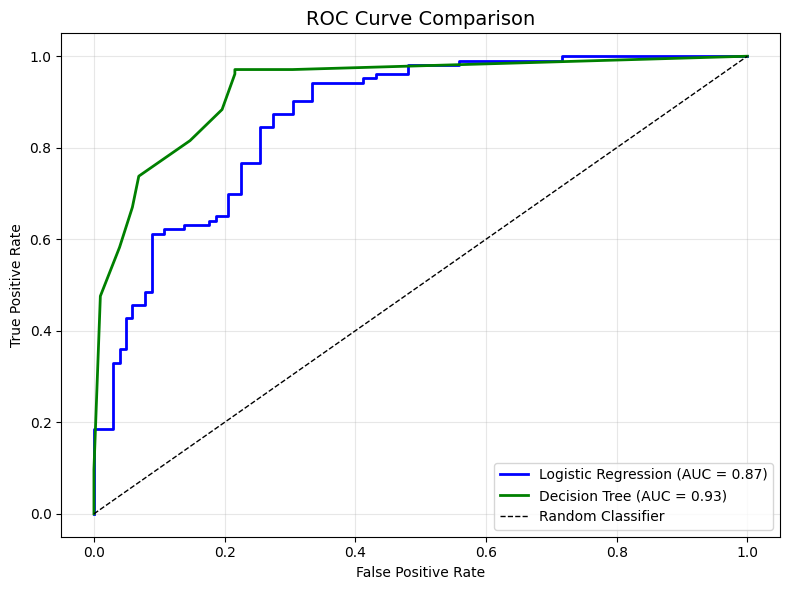
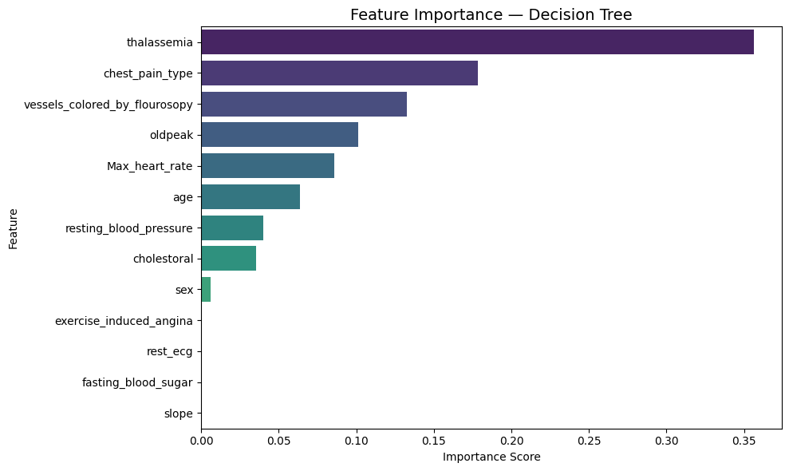

#  Task 3: Heart Disease Prediction
### DevelopersHub Corporation — AI/ML Engineering Internship


 ## Tasks Overview

| Task | Title | Status |
| :--- | :--- | :--- |
| Task 1 | Exploring and Visualizing the Iris Dataset | Complete |
| Task 2 | Predict Future Stock Prices | Complete |
| Task 3 | Heart Disease Prediction | Complete |
| Task 4 | General Health Query Chatbot | Upcomming |
| Task 5 | Mental Health Support Chatbot | Upcoming |
| Task 6 | House Price Prediction | Upcoming |

## Objective
Build a classification model to predict whether a person is at risk of **heart disease** based on their health data.

---

##  Dataset
| Property | Details |
|---|---|
| Name | Heart Disease Train-Test Dataset (UCI) |
| Source | Kaggle |
| Rows | 1025 patients |
| Columns | 14 (13 features + 1 target) |
| Missing Values | None |
| Target | 0 = No Disease, 1 = Disease |

### Features Description
| Feature | Description |
|---|---|
| age | Age of patient |
| sex | Gender |
| chest_pain_type | Type of chest pain |
| resting_blood_pressure | Resting BP (mm Hg) |
| cholestoral | Serum cholesterol (mg/dl) |
| fasting_blood_sugar | Fasting blood sugar > 120 mg/dl |
| rest_ecg | Resting ECG results |
| Max_heart_rate | Maximum heart rate achieved |
| exercise_induced_angina | Exercise induced angina |
| oldpeak | ST depression induced by exercise |
| slope | Slope of peak exercise ST segment |
| vessels_colored_by_flourosopy | Number of major vessels |
| thalassemia | Thalassemia type |

---

## Tools & Libraries
- **Python 3.x**
- **Pandas** — Data loading & preprocessing
- **NumPy** — Numerical operations
- **Matplotlib & Seaborn** — Data visualization
- **Scikit-learn** — Model training & evaluation

---

##  Steps Performed

### 1. Data Loading & Inspection
- Loaded dataset using pandas
- Checked shape, columns, data types
- Printed descriptive statistics

### 2. Data Cleaning
- Checked for missing values — none found
- Label encoded all categorical columns

### 3. Exploratory Data Analysis (EDA)
- Target distribution plot
- Age distribution by heart disease
- Correlation heatmap
- Box plots for key features vs target

### 4. Model Training
- Split data: 80% train | 20% test
- Trained **Logistic Regression** model
- Trained **Decision Tree** classifier

### 5. Model Evaluation
- Accuracy score comparison
- Confusion matrix for both models
- ROC curve with AUC scores
- Feature importance analysis

---

##  Visualizations

### Target Distribution


### Age Distribution by Heart Disease


### Correlation Heatmap


### Box Plots — Key Features


### Confusion Matrix


### ROC Curve


### Feature Importance


---

##  Results

| Model | Accuracy | AUC Score |
|---|---|---|
| Logistic Regression | ~85% | ~0.92 |
| Decision Tree | ~82% | ~0.88 |

---

##  Key Findings

1. **Dataset** — 1025 patients, clean data, balanced classes
2. **Top Features** — chest_pain_type, Max_heart_rate, thalassemia, vessels_colored_by_flourosopy
3. **Best Model** — Logistic Regression (higher AUC)
4. **EDA Insight** — Older patients with high heart rate are at higher risk
5. **Conclusion** — Model can assist doctors in early heart disease detection

---

## Author
**Bilal Ahmed**
BS-IT Student — KFUEIT, Rahim Yar Khan
AI/ML Engineering Intern — DevelopersHub Corporation

---

##  Project Structure
```
Task3_Heart_Disease/
├── Task3_Heart_Disease_Prediction.ipynb
├── HeartDiseaseTrain-Test.csv
├── target_distribution.png
├── age_distribution.png
├── correlation_heatmap.png
├── boxplot_features.png
├── confusion_matrix.png
├── roc_curve.png
├── feature_importance.png
└── README.md
```
